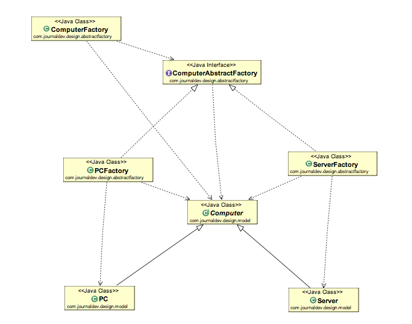

# Abstract Factory Pattern
- provides an interface for creating families of related or dependent objects without specifying their concrete classes
- Factory of factory method

## Class Diagram 


## Code

### Abstract Products
```java
public abstract class Computer {
     
    public abstract String getRAM();
    public abstract String getHDD();
    public abstract String getCPU();
     
    @Override
    public String toString(){
        return "RAM= "+this.getRAM()+", HDD="+this.getHDD()+", CPU="+this.getCPU();
    }
}
```

### Concrete Products
```java
public class PC extends Computer {
 
    private String ram;
    private String hdd;
    private String cpu;
     
    public PC(String ram, String hdd, String cpu){
        this.ram=ram;
        this.hdd=hdd;
        this.cpu=cpu;
    }
    @Override
    public String getRAM() {
        return this.ram;
    }
 
    @Override
    public String getHDD() {
        return this.hdd;
    }
 
    @Override
    public String getCPU() {
        return this.cpu;
    }
}
```

```java
public class Server extends Computer {
 
    private String ram;
    private String hdd;
    private String cpu;
     
    public Server(String ram, String hdd, String cpu){
        this.ram=ram;
        this.hdd=hdd;
        this.cpu=cpu;
    }
    @Override
    public String getRAM() {
        return this.ram;
    }
 
    @Override
    public String getHDD() {
        return this.hdd;
    }
 
    @Override
    public String getCPU() {
        return this.cpu;
    }
}
```

### Abstract Factory Interface 
```java
public interface ComputerAbstractFactory {

	public Computer createComputer();

}
```
### Concrete Factories
```java
public class PCFactory implements ComputerAbstractFactory {

	private String ram;
	private String hdd;
	private String cpu;
	
	public PCFactory(String ram, String hdd, String cpu){
		this.ram=ram;
		this.hdd=hdd;
		this.cpu=cpu;
	}
	@Override
	public Computer createComputer() {
		return new PC(ram,hdd,cpu);
	}

}
```

```java
public class ServerFactory implements ComputerAbstractFactory {

	private String ram;
	private String hdd;
	private String cpu;
	
	public ServerFactory(String ram, String hdd, String cpu){
		this.ram=ram;
		this.hdd=hdd;
		this.cpu=cpu;
	}
	
	@Override
	public Computer createComputer() {
		return new Server(ram,hdd,cpu);
	}
}
```

### Entry point for Client Class
```java
public class ComputerFactory {

	public static Computer getComputer(ComputerAbstractFactory factory){
		return factory.createComputer();
	}
}
```
### Client class
```java
public class TestFactory {
	public static void main(String[] args) {
		Computer pc = abstractfactory.ComputerFactory.getComputer(new PCFactory("2 GB","500 GB","2.4 GHz"));
		Computer server = abstractfactory.ComputerFactory.getComputer(new ServerFactory("16 GB","1 TB","2.9 GHz"));
		System.out.println("Factory PC Config::"+pc);
		System.out.println("Factory Server Config::"+server);
	}
}
```
## Advantages of Abstract Factory Method
- Isolation of concrete classes
- Exchanging Product Families easily
- Promoting consistency among products

## Disadvantages
- Complexity
- Rigidity with New Product Types
- Increased Number of Classes
- Dependency Inversion Principle Violation
- Limited Extensibility