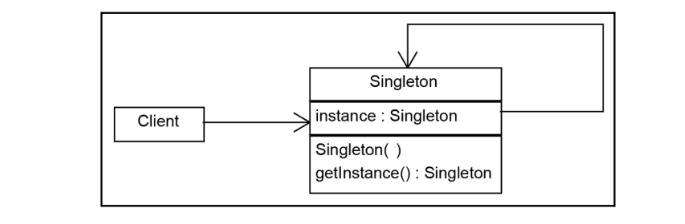

# Singleton Design pattern
- It ensures a class only has one instance, and provides a global point of access to it. 
- Singleton classes are used for logging, driver objects, caching, and thread pool, database connections. 


## Class Diagram



## Key Component of Singleton Design Pattern:

### 1. Static Member:
The Singleton pattern employs a static object within the class. This static member ensures that memory is allocated only once, preserving the single instance of the Singleton class.

### 2. Private Constructor:
The Singleton pattern incorporates a private constructor, which serves as a barricade against external attempts to create instances of the Singleton class. 

### 3. Static Factory Method:
This method acts as a gateway, providing a global point of access to the Singleton object. When someone requests an instance, this method either creates a new instance (if none exists) or returns the existing instance to the caller.

## Ways to achieve Singleton pattern

 ### 1. Early initialization

```java
  public class EagerInitializedDbConnection {

    private static final EagerInitializedDbConnection instance = new EagerInitializedDbConnection();

    // private constructor to avoid client applications using the constructor
    private EagerInitializedDbConnection(){}

    public static EagerInitializedDbConnection getInstance() {
        return instance;
    }
}

```

### 2. Lazy Initialization 
```java
public class LazyInitializeddDbConnection {

    private static LazyInitializeddDbConnection instance;

    private LazyInitializeddDbConnection(){}

    public static LazyInitializeddDbConnection getInstance() {
        if (instance == null) {
            instance = new LazyInitializeddDbConnection();
        }
        return instance;
    }
}
```

### 3. Synchronized Method 
```java
public class ThreadSafeDbConnection {

    private static ThreadSafeDbConnection instance;

    private ThreadSafeDbConnection(){}

    public static synchronized ThreadSafeDbConnection getInstance() {
        if (instance == null) {
            instance = new ThreadSafeDbConnection();
        }
        return instance;
    }
}
```
### 4. Double Locking
```java
public class DoubleLockingDbConnection {

    private static DoubleLockingDbConnection instance;

    private DoubleLockingDbConnection(){}

    public static DoubleLockingDbConnection getInstanceUsingDoubleLocking() {
        if (instance == null) {
            synchronized (DoubleLockingDbConnection.class) {
                if (instance == null) {
                    instance = new DoubleLockingDbConnection();
                }
            }
        }
        return instance;
    }   
}
```
## Use Case of Singleton Pattern
- Database Connections
- Configuration Management- a Singleton configuration manager can provide a single point of access to these settings.
- GUI Components-  For graphical user interface (GUI) components or controllers, a Singleton can help manage the state and actions of the UI, providing a single point of control.
- Device Managers- a Singleton can be used to manage and control access to hardware devices/embedded systems to avoid conflicts.
- Printing Service

## Advantages of Singleton Design Pattern
- Solves Name Collisions
- Eager or Lazy Initialization
- Thread Safety
- Reduced Memory Footprint- ensuring that there is only one instance of the class.

## Disadvantages of Singleton Design Pattern
- Concurrency Issues- If multiple threads attempt to access the Singleton simultaneously, it can result in race conditions.
- Limited Extensibility- if need multiple instances of the class or want to change the instantiation logic, it may require significant refactoring.
- Global Dependency-  The Singleton pattern creates a global dependency, making it harder to replace the Singleton with an alternative implementation or to use dependency injection for providing instances.
- Hard to Subclass- Subclassing a Singleton can be challenging. Because the constructor is typically private, extending a Singleton requires additional care and may not follow standard inheritance patterns.
- Lifecycle Management- The Singleton pattern may not handle scenarios where the instance needs to be explicitly destroyed or reset.
- Global Access Point Abuse- Developers might be tempted to use the Singleton for everything, leading to an overuse of global state and a less modular design.
-Testing Difficulties- Testing one component in isolation may be more complicated if it relies on a Singleton, as the state of the Singleton may affect the outcome of tests.
