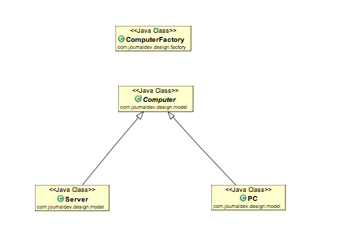

# Factory Design Pattern
- provides an interface for creating objects in a superclass, but allows subclasses to alter the type of objects that will be created.
- This pattern is useful when you need to decouple the creation of an object from its implementation.
- Super class in factory design pattern can be an interface, abstract class or a normal java class.

## Class Diagram


## Code

### Super Class
```java
public abstract class Computer {
	
	public abstract String getRAM();
	public abstract String getHDD();
	public abstract String getCPU();
	
	@Override
	public String toString(){
		return "RAM= "+this.getRAM()+", HDD="+this.getHDD()+", CPU="+this.getCPU();
	}
}
```

### Sub Classes
```java
public class PC extends Computer {

	private String ram;
	private String hdd;
	private String cpu;
	
	public PC(String ram, String hdd, String cpu){
		this.ram=ram;
		this.hdd=hdd;
		this.cpu=cpu;
	}
	@Override
	public String getRAM() {
		return this.ram;
	}

	@Override
	public String getHDD() {
		return this.hdd;
	}

	@Override
	public String getCPU() {
		return this.cpu;
	}

}
```

```java
public class Server extends Computer {

	private String ram;
	private String hdd;
	private String cpu;
	
	public Server(String ram, String hdd, String cpu){
		this.ram=ram;
		this.hdd=hdd;
		this.cpu=cpu;
	}
	@Override
	public String getRAM() {
		return this.ram;
	}

	@Override
	public String getHDD() {
		return this.hdd;
	}

	@Override
	public String getCPU() {
		return this.cpu;
	}
}
```

### Factory Class
```java
public class ComputerFactory {

	public static Computer getComputer(String type, String ram, String hdd, String cpu){
		if("PC".equalsIgnoreCase(type)) return new PC(ram, hdd, cpu);
		else if("Server".equalsIgnoreCase(type)) return new Server(ram, hdd, cpu);
		
		return null;
	}
}
```

### Client
```java
public class Client {
	public static void main(String[] args) {
		Computer pc = ComputerFactory.getComputer("pc","2 GB","500 GB","2.4 GHz");
		Computer server = ComputerFactory.getComputer("server","16 GB","1 TB","2.9 GHz");
		System.out.println("Factory PC Config::"+pc);
		System.out.println("Factory Server Config::"+server);
	}
}
```
## Advantages of Factory Method
- Abstraction
- Maintainability 
- Less coupled 
- easy to extend

## Disadvantages
- Increase complexity of code