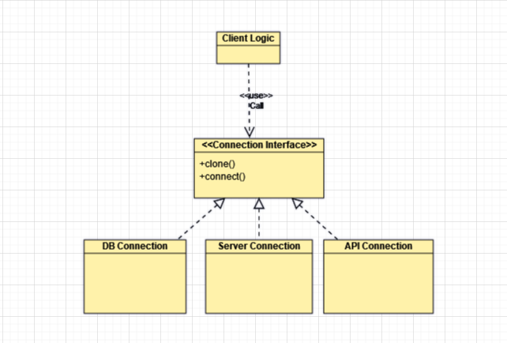

# Prototype Design Pattern
- Creation of new object by cloning the existing object.
- Do modification with properties on cloned object as per the reqirement.
- Hide the complexity of creating new object from the client.

## Class Diagram



## Code

### Prototype Interface

```java
// This is like a blueprint for creating connection.
// It says every connection should be able to clone itself and connect.
public interface Connection{
    Connection clone();  // Make a copy of itself
    void connect();    // Establish the connection
}
```

### Concrete Prototype (DB Connection)
```java

// This is a specific Connection, a DB Connection, implementing the Connection interface.
// It can create a copy of itself (clone) and establish connection in its own way.
public class DbConnection implements Connection {

    private String connectionURL;
    String connectionPort;
    String databaseType;
    String clusterType;
    String principalUser;
    long activeConnectionDuration;
 
    // When you create a DbConnection, you give value to its attribute.
    public DbConnection(String connectionURL,
                        String connectionPort,
                        String databaseType,
                        String clusterType,
                        String principalUser,
                        long activeConnectionDuration) {
        this.connectionURL = connectionURL;
        this.connectionPort = connectionPort;
        this.databaseType = databaseType;
        this.clusterType = clusterType;
        this.principalUser = principalUser;
        this.activeConnectionDuration = activeConnectionDuration;
    }
 
    // This creates a copy of the DbConnection.
    @Override
    public Connection clone() {
        return new DbConnection(this.connectionURL,
                                this.connectionPort,
                                this.databaseType
                                this.clusterType
                                this.principalUser
                                this.activeConnectionDuration);
    }
 
    // This is how a Db Connection is establish.
    @Override
    public void connect() {
        SomeFeignClient.connect(connectionURL,connectionPort,principalUser);
    }
}
```

### Client

```java
// This is like a user of Connection.
// It uses a prototype (a Connection) to create new Connections.
public class ConnectionClient {
     public static void main(String[] args) {
        // Create a concrete prototype (a mongo Connection).
        Connection mongoConnection = new DbConnection("mongoURL+password","mongoPort","mongo","mongocluster","Avadhesh",120);
 
        // Use the prototype to create a new Connection.
        Connection newMongoConnection = mongoConnection.clone().setPrincipalUser("Chamola");
 
        // Establish the Connection.
        newMongoConnection.connect();
    }
}

```

## When to use the Prototype Design Pattern
- Variations of Objects- when there is very less difference in clonned object in camparison to base object.
- Creating Objects is Costly: when creating object require significant resources such as DB call or external object call.
- Reducing Initialization Overhead- when the initialization process is resource-intensive.
- Dynamic Configuration- when need to create object at runtime

## When not to use the Prototype Design Pattern 
- Unique Object Instances- each object has lot of properties change in comparision to base object.
- Simple Object Creation
- Immutable Objects- If your objects are immutable (unchangeable) and do not need variations, the benefits of cloning may not be significant. Immutable objects are often safely shared without the need for cloning.
- Clear Object Creation Process- contains no private attribute or api/db calls
- Limited Object Variations- If there are only a few variations of objects, and creating subclasses or instances with specific configurations is manageable

